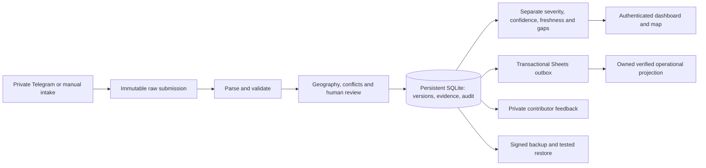

# Dawei flood intelligence

An authenticated village reporting, verification and assistance coordination service. The existing MVP has been hardened for a **single persistent host**. Production hosting and live provider commissioning remain external actions; no live URL or verified hosted HTTPS is claimed.

## Release state

| State | Evidence |
|---|---|
| IMPLEMENTED | Immutable intake, versioned corrections, review/evidence, RBAC, field freshness, explainable severity, resource stock/flow, private feedback, safe exports and interactive coordinate map |
| CONFIGURED | Gunicorn, non-root Docker, Caddy HTTPS configuration, persistent Compose volumes, signed scheduled backups, provider workers and GitHub validation/release workflows |
| TESTED | 53 automated tests, dependency audit, Bandit, browser inspection, container restart smoke, migration and signed restore drill; see [acceptance results](docs/acceptance-results.md) |
| NOT YET COMMISSIONED | Hosting/domain/TLS, individual production accounts, Telegram token/mapping, Google service account/destination, encrypted off-site backup, monitoring alerts and field acceptance |

The supplied Sheet was exported read-only. It was not edited. Snapshots, operational databases, secrets, private identifiers and exports are excluded from this repository and the image. A clean checkout initializes an empty database unless an operator privately supplies snapshots.

## Local setup

Use Python 3.12 (the tested container version). No npm build or runtime CDN is required.

```sh
python3 -m venv .venv
. .venv/bin/activate
python -m pip install -r requirements-production.txt
python -m flood.cli init
python -m flood.server --local-preview --port 8765
```

Open `http://127.0.0.1:8765`. Preview is read-only and loopback-only. For local authenticated work, stop preview, provision individual accounts privately, then start without `--local-preview`:

```sh
python -m flood.cli create-user --username operator --role administrator
python -m flood.cli create-user --username field-user --role contributor
python -m flood.server --port 8765
```

Passwords are prompted privately. Roles are contributor, reviewer, analyst, coordinator and administrator. Use the Gunicorn/Caddy deployment for network service; `flood.server` is a development preview.

## Checks and recovery

```sh
python -m unittest discover -s tests -v
python -m compileall -q flood tests
for script in apps/dashboard/*.js; do node --input-type=module --check < "$script"; done
python scripts/secret_scan.py
python -m flood.cli backup --output /private/path/backup.sqlite3
python -m flood.cli check-backup --input /private/path/backup.sqlite3
python -m flood.cli restore --input /private/path/backup.sqlite3 --output /private/new-path/restored.sqlite3
```

Backup bundles also retain source snapshots, checksummed manifests and HMAC signatures. Production requires a private signing key, an hourly worker and encrypted off-site copies. Detailed commands, key custody, retention and incident procedures are in [operations](docs/operations.md).

## Architecture



Corrections reopen verification and preserve earlier versions. Pledges, dispatch, delivery and confirmed receipts remain separate; only receipts reduce the confirmed gap. Retries retain stable report IDs. Telegram replies can repeat after a lost network acknowledgement, while canonical ingestion remains idempotent.

## Integration and deployment

[Deployment guide](docs/deployment.md) describes the chosen Linux host + Compose architecture, secret files, persistent volumes, TLS, updates and acceptance. [Telegram guide](docs/telegram.md) covers guided/structured intake and commands. [Operations](docs/operations.md) covers server-side Google authorization, schema-safe sync and bounded retry recovery. Both integrations remain NOT COMMISSIONED until real round trips succeed.

GitHub hosts source, PR review and CI. The Python API and persistent database require server-capable hosting. Release workflow publishes a commit-tagged GHCR image only after validation; deployment and hosted health verification remain operator-controlled.

## Data and analytical limits

The private source has 75 worklist rows, 74 distinct township/name pairs, zero completed field assessments, 63 named provisional public reports and four excluded placeholders. There are no supplied coordinates or observation times. Ambiguous public-table H:O cells are quarantined. The partial inventory is not a regional denominator; no report never means no need. Source links were not independently corroborated.

No humanitarian weights or decay constants are active without owner approval. Unknown counts remain unknown; incomplete severity intervals are not ranked. The map renders only reviewed supplied coordinates. Boundary choropleths, hazard-based silent-zone inference, calibrated probabilities, confidence intervals and Monte Carlo forecasts require additional evidence and are deferred. Core navigation and actions use centralized English/Burmese resources; some technical explanations remain English pending field terminology review.

See [readiness](docs/deployment-readiness.md), [security](docs/security.md), [data model](docs/data-model.md), [methods](docs/methodology.md), [source quality](docs/source-quality.md), [dashboard](docs/dashboard.md), [design review](docs/design-review.md), and [roadmap](docs/roadmap.md).
