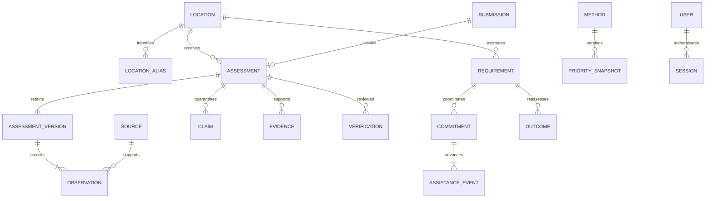

# Canonical model, dictionary and Sheets projection

## Entities and relationships

Observation rows represent population, needs, infrastructure, access and communication fields. Sources contain independence groups; raw claims remain immutable. Dispatch, delivery and receipt are distinct immutable assistance events. The current assessment/commitment row is a projection of retained history. SQLite migration version is 2; IDs use UUID-derived strings, imported field IDs remain intact.

## Dictionary contract

The complete machine-readable field dictionary is served at `/api/v1/dictionary` and included in the processed workbook. Each entry gives field name, label, type, allowed values, unit, requirement, missingness, validation, raw/derived status and sensitivity. Burmese field-entry labels from the source remain in the source mapping. Newly added Burmese technical terms require local terminology review; no guessed translation is considered approved.

| Family | Fields | Type/unit and validation | Requirement / sensitivity |
|---|---|---|---|
| Geography | state_region, district, township, village_tract, village, location_id | Unicode text; composite identity, no automatic fuzzy match | state/township/village or approved location ID; operational |
| Coordinates | latitude, longitude, coordinate_source | Finite degrees, lat ±90, lon ±180; paired/source required | Optional; operational/reviewer-approved before map |
| Time | observed_at, reported_at, valid_until, last_confirmed_at | Timezone-aware ISO time; observed/reported not future | Observation required for new reports; imported unknown retained |
| Population | population_total, affected_population, displaced_population, children_affected, elderly_affected, persons_with_disabilities_affected, pregnant_people_affected | Whole nonnegative people; subset checks; dispute path | Optional, absent=not assessed; village aggregate |
| Households | households_total, affected_households, displaced_households | Whole nonnegative households; subset checks | Optional, absent=not assessed |
| Casualties | deaths, injuries, missing | Whole nonnegative people, high-impact review | Optional; no names; operational |
| Housing | houses_destroyed, houses_major_damage, houses_minor_damage | Whole nonnegative houses | Optional; do not combine grades |
| Needs | food/water/shelter/medical/sanitation/hygiene/clothing/child/elderly/disability_need | none/low/medium/high/critical | none is explicitly assessed no need; absent=not assessed |
| Access | road_access | open/limited/blocked | Optional; unknown distinct from open |
| Services | electricity, mobile_network, clean_water | normal/partial/out; normal/weak/out; adequate/limited/critical | Optional, field-specific approved freshness |
| Provenance | source_reference, source_type, independence_group | Text, source retained, copies grouped | Source required; source notes restricted |
| Baseline | baseline_year, baseline_source, baseline_disputed, baseline_dispute_reason | Integer year/text/boolean; dispute requires reason | No silent rejection of disputed baseline |
| Missingness | per-field map | unknown/not_assessed/not_applicable/withheld/unable_to_verify | Explicit state cannot coexist with known value |
| Report metadata | submission ID, report ID, version, status, owner, received_at, parser_version | Server assigned | Immutable IDs, original raw restricted |
| Resource requirement | resource, quantity, unit, usable_stock, period, observed_at, source | Finite nonnegative amount; compatible unit/period | Quantity/source/time required; unknown stock gives unknown gap |
| Commitment/event | organization, requirement_id, quantity, status, source, actor, time | Valid state transition; receipt ≤ delivery ≤ commitment | Coordinator/reviewer controlled; operational |
| Outcome | requirement_id, observed_at, source, payload | New observation; cannot auto-resolve requirement | Separate from delivery |
| Derived | metric sample size/missing count, severity interval, contributions, freshness, gap | Versioned formulas; all have record lineage | Not observed facts; no automatic allocation |

## Google Sheets workbook schema

Prepared workbook tabs: `00_Read_Me`, `01_Locations`, `02_Assessments`, `03_Population_Impact`, `04_Needs`, `05_Infrastructure`, `06_Assistance`, `07_Evidence`, `08_Verification_Queue`, `09_Audit_Log`, `10_Data_Dictionary`, `11_Lookups`, `12_Dashboard_Export`, `13_Source_Quality`, `14_Quarantined_Claims`. Empty operational tables have headers; they are not seeded with fictional observations. Raw source remains in local private storage.

Runtime sync writes only the dedicated `12_Dashboard_Export` projection after verification, never edits the source's Burmese tabs. It uses report_id, location_id, version, township, village, observation time, status, affected/displaced people/households, source_reference and method_version. Headers are checked before updates. Retries replace the same full projection rather than appending duplicate records. A schema-owner must protect IDs/version/header columns and assign human editing privileges before commissioning.

Statuses: submitted, needs_review, verified, rejected, superseded. Draft is persistent contributor state before canonical submission. Provisional acceptance is not verification. Imported public reports always start needs_review.

## Operational schema 2

Migration 002 adds persistent hashed login buckets, owner-addressed feedback and private Telegram recipients, commitment ETA/expiry terms, immutable claim/duplicate resolutions and report links. Feedback delivery metadata is mutable; its content, priority snapshots, evidence and outcomes are append-only. Claim corrections are recorded separately from original values. Report versions retain actor/reason/source and field_observed_at/field_confirmed_at maps. Review history stores version-specific verified_at; the current received_at is submission time, never substituted for unknown source observation time. Nested transactions use savepoints; raw retention and canonical idempotency are checked transactionally.
