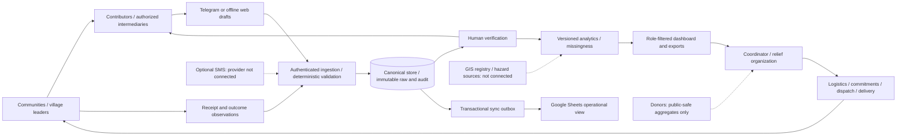
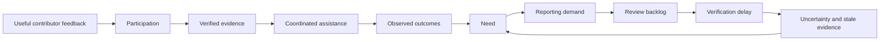
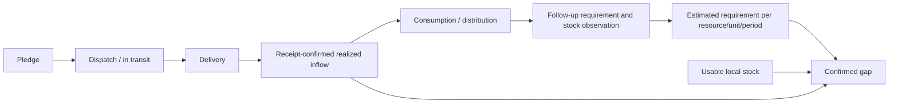

# Systems and critical-thinking design review

## ADR-001: Scope and storage

Start with a local, dependency-light Python API and responsive web application. SQLite gives transactional persistence and immutable history without installing a database. Repository methods isolate storage. PostgreSQL/PostGIS is the scale target and requires a tested adapter and migration before multi-instance deployment. A standard-library HTTP server is appropriate for local operation and acceptance testing; commission a supported ASGI/WSGI stack or managed gateway, managed identity and TLS before exposed production use. Google Sheets is a selected operational projection, never the only historical store. Plain JavaScript modules avoid a network dependency for low-bandwidth use. Static files contain no records or credentials.

## Assumptions and stakeholder/incentive map

Initial scope is Tanintharyi/Dawei district, because the supplied dataset is scoped there. Contributor/report volume, budget, retention and Workspace ownership are unknown. Assume village-level observations, internal access, Unicode Burmese village names, English and Burmese navigation, poor connectivity, no household PII. Reviewers authorize verification; analysts can change versioned methods; coordinators record assistance; administrators manage identity and integrations. No ranking weights, time-decay values or humanitarian standards are approved by this document. New reporters have unknown reliability and are not penalized. No automatic allocation or fraud accusation occurs.

| Actor | Input/output | Incentive, trust, delay and failure | Feedback |
|---|---|---|---|
| Community/leader | Observations, receipt/outcome confirmation | Safety and aid; unverified until evidence; access and connectivity delays | Report status and refresh requests through authorized contributors |
| Field contributor | Structured report/evidence | Fast aid, possible duplication; identity allowlist, claims provisional | Submission ID, correction errors and review status |
| Reviewer | Claims, source cells and discrepancies → decisions | Accuracy versus queue pressure; authorized, accountable | Correction reason and unresolved contradiction |
| Analyst | Aggregates, formulas → decision-support indicators | Coverage and missingness bias; method changes audited | Sensitivity and lineage |
| Coordinator/organization | Need → pledge/dispatch/delivery | Visibility may attract duplicate aid; receipts required | Unit-safe gaps and coordination warning |
| Donor | Public-safe aggregate → funding | Selective visibility; no operational access assumed | Separate activity and outcomes |
| Administrator | Identity/configuration → access, backups | High trust, privileged compromise risk | System-health and audit |
| Telegram | Messages → durable drafts/submissions | External dependency, network retry | Acknowledgement after transaction |
| Google Sheets | Operational projection | Quotas, human edits, schema drift | Outbox status; canonical store survives failures |
| GIS/hazard provider | Registry, boundaries, exposure | Spatial mismatch, stale/partial inventory | Source/accuracy disclosure; unavailable layers explicit |
| Logistics | Commitment → dispatch → receipt | Roads/stock/transport delay, unsafe details | Follow-up need assessment; no automatic rerouting |

## System boundary and trust boundaries

Trust boundaries: external Telegram input; authenticated API; private canonical storage; role-filtered browser/export; external Google API. Secrets stay in environment/secret files. The initial Sheet is a read-only input. Schema migration does not overwrite existing tabs.

## Causal loops, stock/flow and information/resource flow

Backlog is a reinforcing delay loop; coordination/outcome reassessment is a balancing loop. More connected communities may gain more reporting and assistance, reinforcing visibility bias. Do not assume assistance causes recovery without follow-up evidence.

Need is a planning estimate. Pledge is a decision. Dispatch is a movement. Delivery is a reported event. Receipt is confirmation; none are interchangeable. Resource quantities cannot be combined across units, category or planning period. Requirements are reassessed after consumption.

## Delay map, bottlenecks and leverage points

Track observed→received, received→review, review→verification, verification→pledge, pledge→dispatch, dispatch→delivery and delivery→receipt. Unknown observation time produces unknown delay, not zero. Initial health shows queue count and oldest received record; verified reports expose review lag. Logistics timing is available on append-only assistance events. History supports later period/geography bottleneck trends. Candidate leverage points are evidence requests resolving many quarantined claims, validated place identities and reviewer capacity. Do not infer bridge catchments without a road network.

## Bias, silent zones and confidence

The source's field-entry list is a partial worklist, not a complete settlement census. Show named rows, unmatched names and unassessed worklist entries. Regional reporting coverage is unknown. A potential silent-zone classification requires an approved complete registry plus hazard/exposure/neighbor evidence and recency policy; it is not activated with the current data. Unreported never means safe. Source repetition belongs to one independence group. Claims remain provisional until reviewers attest selected field evidence. Confidence is a qualitative evidence status; probabilities require future calibration. Humanitarian severity uses observed needs; investigation reasons use missingness, stale evidence, contradictions and identity risk. Never multiply severity by confidence.

## Freshness and verification tiers

Freshness is based on each claim's observation time; upload/update date is not substituted. Optional decay is exp(-ln(2)*age_hours/approved_half_life_hours). Unknown observation time yields unknown freshness. Parameters remain inactive until an analyst saves an approved method with reason. Low-risk structured observations enter provisionally. Operational claims require review. Casualties, disputed baselines and large emergencies require selected evidence and authorized review. Review does not silently repair source columns.

## Sensitivity, deconfliction and outcome feedback

Expose each observed component, weight and contribution, unknown component bounds, method version and source IDs. Alternative scenarios multiply one chosen weight and renormalize; they are explicitly scenarios. Draft weights do not generate ranks. Coordination compares requirement, receipts, in-transit and pledges separately; excess projected supply is a warning for humans. Outcomes are separate dated follow-up observations and never auto-resolved from delivery.

## Threats and pre-mortem

| Failure | Likelihood / impact (qualitative assumption) | Detection | Prevention / mitigation / owner |
|---|---|---|---|
| Telegram outage | Possible / high | Worker retry/error status | Durable checkpoint, retry, web entry; integration owner |
| Sheets quota or permission failure | Possible / medium | Outbox attempts/error | Canonical transaction survives; retry exact projection; administrator |
| Database outage/corruption | Possible / high | Integrity test and health | Backups, tested restore, disk alert; administrator |
| Wrong place matching/boundary | Likely / high | Composite identity/unmatched queue | No fuzzy auto-merge, human coordinate source; GIS reviewer |
| Duplicate/copy submissions | Likely / high | Idempotency/source independence | Exact replay returns same ID, duplicate suggestions; reviewer |
| Malicious input/injection | Possible / high | Validation/rate limits | Bound input, SQL parameters, safe DOM/export; administrator |
| Compromised account | Possible / high | Audit and login signals | Individual identity, least privilege, revoke sessions/MFA before production; administrator |
| Stale evidence drives aid | Likely / high | Per-field age/missing time | Original value retained, approved recency, refresh; coordinator |
| Visibility/priority bias | Likely / high | Coverage and sensitivity | No report-frequency weighting, separate investigation; analyst |
| Reviewer overload | Likely / high | Queue age/lag | Explicit tiers and staffing, do not auto-verify high-impact claims; review lead |
| Incorrect source spreadsheet | Observed / high | Type/schema alignment checks | Quarantine H:O, source lineage, reconciliation; data owner |
| SMS cost/failure | Unknown / medium | Provider metrics when enabled | Disabled without provider/budget; administrator |
| Lost credentials | Possible / high | Integration failure | Secret manager recovery, rotate; administrator |
| Sensitive export/static exposure | Possible / high | Role tests and artifact scan | No raw/source notes in general export; restricted files excluded; security owner |
| Backup fails to restore | Possible / high | Restore acceptance test | Integrity + row count reconciliation; administrator |

## Ethical/privacy/access-control review

Do not collect household identities or publish precise logistics. Raw evidence is reviewer/admin-only. General analytic exports contain typed village-level aggregates and source references, not reporter identifiers or unrestricted notes. Contributors can read their own reports, never others' raw source material. Human decisions and override reasons are audited. Retention, privileged MFA, encryption at rest, backup schedule, external hosting and public-data policy need owner approval before launch.

## Feature gate

Each new feature must state problem, assumptions/evidence, exclusion risks, gaming, failure signals, reversibility, simpler alternatives and accountable oversight. Advanced probabilistic models and spatial inference are deferred until registry/evidence assumptions can be tested. The current MVP provides an honest operational foundation; it is not commissioned production infrastructure.
